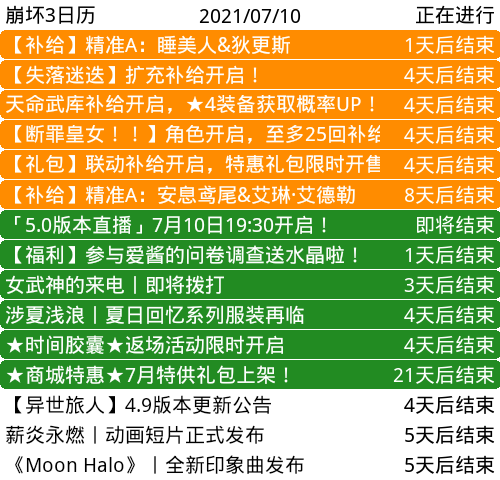

# bh3_calendar

~~公主连结~~崩3图形化活动日历插件，Fork的公主连接版本，适用于 `HoshinoBot v2`.

项目地址 <https://github.com/NepPure/bh3_calendar>

原神的👇

<https://github.com/NepPure/genshin_calendar>

## 日程信息源

游戏内公告

## 安装方法

1. 在HoshinoBot的插件目录modules下clone本项目 `git clone https://github.com/NepPure/bh3_calendar.git`
1. 在 `config/__bot__.py`的模块列表里加入 `bh3_calendar`
1. 重启HoshinoBot

## 指令列表

- `崩3日历` : 查看本群订阅服务器日历
- `崩3日历 on/off` : 订阅/取消订阅指定服务器的日历推送
- `崩3日历 time 时:分` : 设置日历推送时间
- `崩3日历 status` : 查看本群日历推送设置
- `崩3日历 cardimage` : (go-cqhttp限定)切换是否使用cardimage模式发送日历图片
